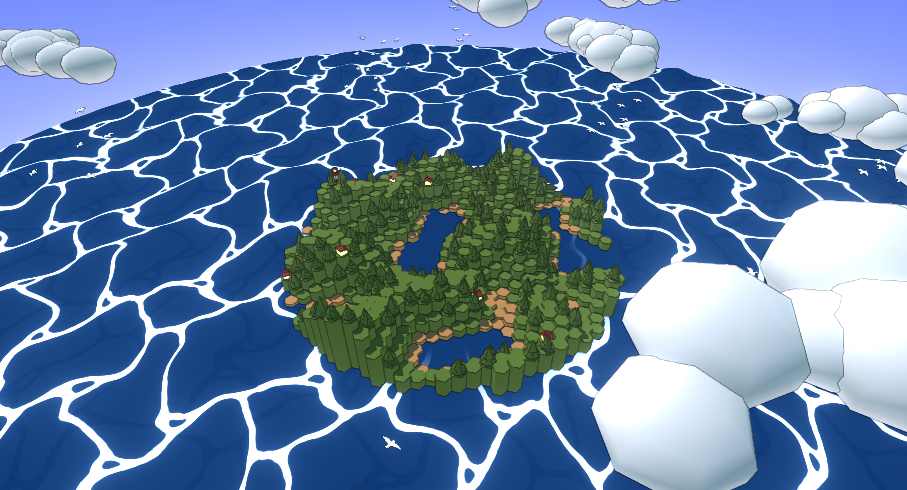

# Procedural Island Generator



### How to run
#### Live version
[https://jumpyjacko.github.io/uts_cg_project/](https://jumpyjacko.github.io/uts_cg_project/)

#### Local server
Download `node` and `npm`.

Get dependencies
```sh
npm install
```

Run dev server
```sh
npm run dev
```
